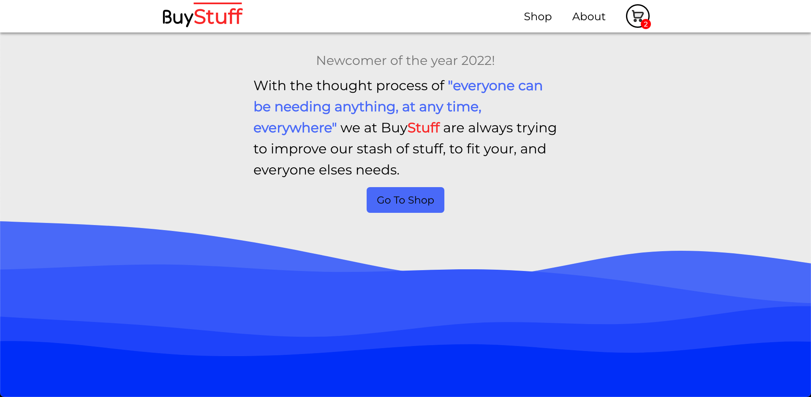
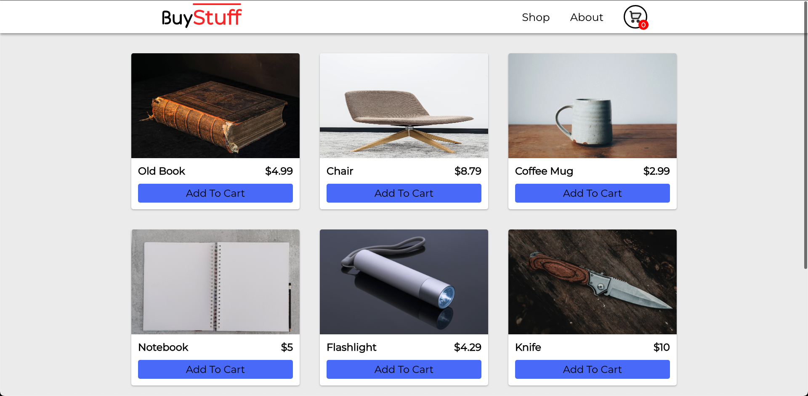
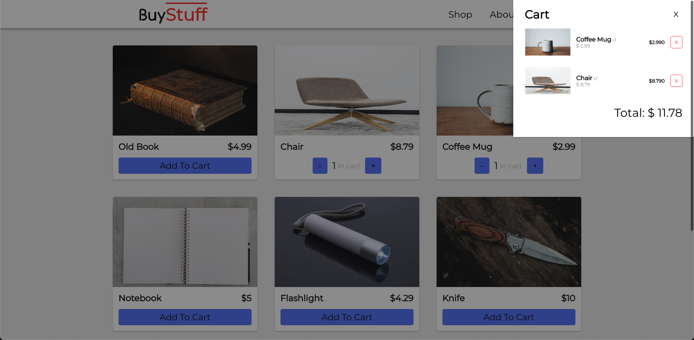

# Shopping Cart

## About 
Responsive shopping cart application created with React where users can add and remove items from the cart as they please.
The overall look of the application was created to be clean and simplistic. 

The vocal point of this project was to improve my knowledge with React and how to use the ReactRouter library to add different pages to an application. 

Both the Home page, as well as the About page may not look as good as it could have, but main focus was put on the Shop and ShoppingCart part of the project. 

> Try it out (here)[linkToPage]

## Screenshots
### Home Page

### Shop Page

### Shop Page with the cart open

## Technologies
* HTML
* CSS/SCSS
* JavaScript

## Tools
* React
* React Router

## Image credit
For the different items in the shop I've used images from [Unsplash](https://unsplash.com/). Here are the images with their corresponding photographer:

* [Book]() by  
* [Chair]() by 
* [Coffe Mug]() by 
* [Flashlight]() by 
* [Knife]() by 
* [Notebook]() by 
* [Rope]() by 
* [Water Bottle]() by 

# Todo
- [x] Add more items to the shop
- [x] Home page
- [x] About page
- [x] Responsiveness
- Add local storage
- [x] Find a better font
- Testing
- [x] Add Screenshots
- Deploy to GitHub pages